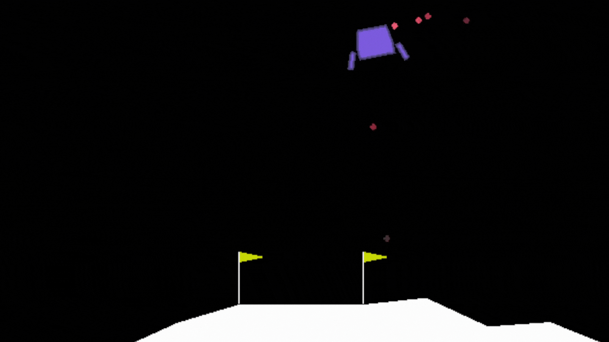

# DoubleHELIX OpenAI Gym: Lunar Landing

## DoubleHELIX LunarLanding
A drop-in replacement for OpenAI's classic LunarLanding gym environment, one of the Hello World's of the ecosystem. This contribution is an effort towards providing higher fidelity gym environments for training adversarial multi-agents. Our gym environments are designed to work out-of-the-box with Stable-Baselines3, a set of reliable implementations of reinforcement learning algorithms.

## Goals of this repository
- Provide a simple interface to train and enjoy RL agents
- Benchmark the different Reinforcement Learning algorithms
- Test tuned hyperparameters for LunarLander environment
- Have fun with the trained agents!
